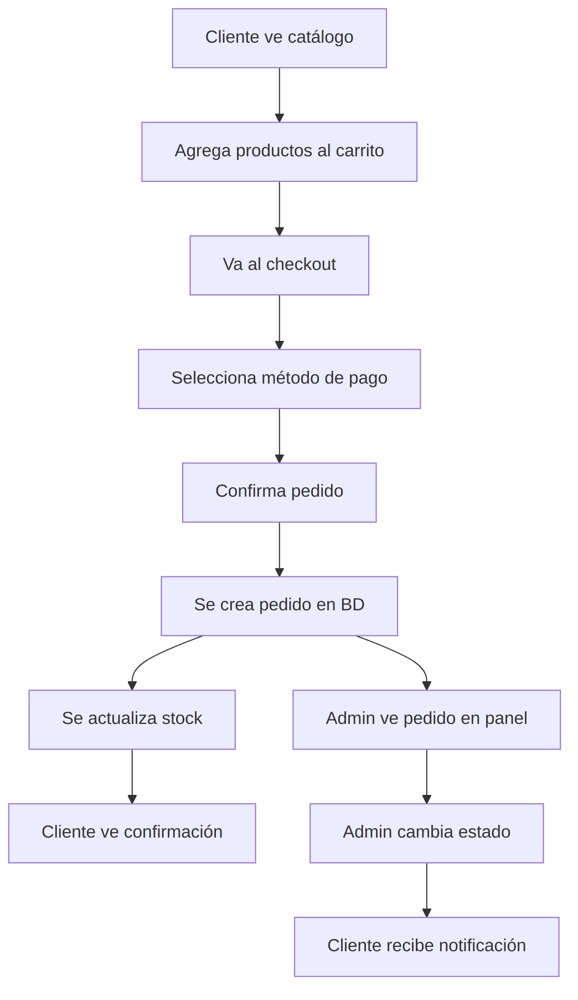

# Sistema de Ventas - Botica EcoSalud

## 🛒 Descripción General

Sistema completo de ventas que permite a los clientes realizar pedidos desde el frontend y a los administradores gestionar estos pedidos desde el panel de administración.

## 🔄 Flujo Completo de Venta

### Para Clientes:
1. **Navegar catálogo** → Ver productos disponibles
2. **Agregar al carrito** → Seleccionar productos y cantidades
3. **Ir al carrito** → Revisar productos seleccionados
4. **Proceder al checkout** → Iniciar proceso de compra
5. **Seleccionar método de pago** → Elegir forma de pago
6. **Confirmar pedido** → Finalizar la compra
7. **Ver confirmación** → Recibir detalles del pedido

### Para Administradores:
1. **Ver pedidos** → Lista de todos los pedidos en el panel admin
2. **Cambiar estados** → Actualizar estado de pedidos (Pendiente → Procesando → Completado)
3. **Ver detalles** → Información completa de cada pedido
4. **Exportar reportes** → Generar archivos CSV de ventas

## 📊 Estados de Pedidos

| Estado | Descripción | Color |
|--------|-------------|-------|
| **PENDIENTE** | Pedido recién creado, esperando procesamiento | 🟡 Amarillo |
| **PROCESANDO** | Pedido en preparación | 🔵 Azul |
| **COMPLETADO** | Pedido entregado exitosamente | 🟢 Verde |
| **CANCELADO** | Pedido cancelado | 🔴 Rojo |

## 🗄️ Estructura de Base de Datos

### Tablas Principales:

#### `pedidos`
```sql
- idPedido (PK)
- total (DECIMAL)
- estado (VARCHAR)
- fechaPedido (DATE)
- idUsuario (FK → usuarios)
- idMetodoPago (FK → metodos_pago)
```

#### `detalle_pedido`
```sql
- idDetalle (PK)
- cantidad (INT)
- precioUnitario (DECIMAL)
- subtotal (DECIMAL)
- idPedido (FK → pedidos)
- idProducto (FK → productos)
```

#### `metodos_pago`
```sql
- id_metodo (PK)
- nombre (VARCHAR)
- descripcion (TEXT)
- activo (BOOLEAN)
```

## 🚀 Configuración e Instalación

### 1. Base de Datos
```bash
# Ejecutar el script SQL
mysql -u usuario -p nombre_bd < docs/sistema-ventas-completo.sql
```

### 2. Backend
Los controladores y servicios ya están configurados:
- `PedidoController` - Manejo de pedidos
- `PedidoService` - Lógica de negocio
- `MetodoPagoController` - Métodos de pago

### 3. Frontend
Las páginas ya están creadas:
- `CheckoutPage` - Proceso de compra
- `OrderConfirmation` - Confirmación de pedido
- `OrdersPage` - Panel admin de pedidos

## 🔐 Seguridad y Permisos

### Endpoints Protegidos:

#### Para Clientes (CLIENT/CLIENTE):
- `POST /api/pedidos/create` - Crear pedido
- `GET /api/pedidos/usuario/{id}` - Ver sus pedidos
- `GET /api/pedidos/{id}/detalles` - Ver detalles de sus pedidos

#### Solo para Administradores (ADMIN):
- `GET /api/pedidos/all` - Ver todos los pedidos
- `PUT /api/pedidos/{id}/estado` - Cambiar estado
- `GET /api/pedidos/estadisticas` - Ver estadísticas
- `GET /api/pedidos/export/csv` - Exportar reportes

#### Públicos:
- `GET /api/metodos-pago/activos` - Ver métodos de pago disponibles

## 📱 Páginas del Sistema

### Frontend Cliente:

#### `/checkout`
- **Función:** Proceso de finalización de compra
- **Acceso:** Solo usuarios autenticados con productos en carrito
- **Características:**
  - Resumen del pedido
  - Selección de método de pago
  - Información de entrega
  - Confirmación final

#### `/pedido-confirmado`
- **Función:** Confirmación de pedido exitoso
- **Acceso:** Solo después de crear un pedido
- **Características:**
  - Detalles del pedido creado
  - Información de seguimiento
  - Próximos pasos

### Panel Administrador:

#### `/admin/pedidos`
- **Función:** Gestión completa de pedidos
- **Acceso:** Solo administradores
- **Características:**
  - Lista de todos los pedidos
  - Cambio de estados en tiempo real
  - Exportación a CSV
  - Filtros y búsqueda

## 🛠️ API Endpoints

### Crear Pedido
```http
POST /api/pedidos/create
Content-Type: application/json
X-User-Role: CLIENT

{
  "idUsuario": 1,
  "idMetodoPago": 1,
  "detalles": [
    {
      "idProducto": 1,
      "cantidad": 2
    }
  ]
}
```

### Cambiar Estado
```http
PUT /api/pedidos/1/estado
Content-Type: application/json
X-User-Role: ADMIN

{
  "nuevoEstado": "PROCESANDO"
}
```

### Obtener Pedidos
```http
GET /api/pedidos/all
X-User-Role: ADMIN
```

## 📈 Funcionalidades Implementadas

### ✅ Gestión de Pedidos
- [x] Crear pedidos desde el carrito
- [x] Validación de stock automática
- [x] Cálculo automático de totales
- [x] Actualización de inventario

### ✅ Métodos de Pago
- [x] Efectivo
- [x] Tarjeta de Crédito/Débito
- [x] Transferencia Bancaria
- [x] Yape/Plin

### ✅ Panel de Administración
- [x] Lista de pedidos en tiempo real
- [x] Cambio de estados
- [x] Exportación a CSV
- [x] Estadísticas básicas

### ✅ Seguridad
- [x] Control de acceso por roles
- [x] Validación de permisos en API
- [x] Protección de rutas frontend

## 🔄 Flujo de Datos



## 🧪 Testing del Sistema

### Probar como Cliente:
1. Registrarse con rol "CLIENT"
2. Agregar productos al carrito
3. Ir a checkout
4. Completar el pedido
5. Ver confirmación

### Probar como Admin:
1. Iniciar sesión como admin
2. Ir a `/admin/pedidos`
3. Ver pedidos creados
4. Cambiar estados
5. Exportar CSV

## 📊 Reportes y Estadísticas

### Vistas Creadas:
- `vista_estadisticas_ventas` - Estadísticas diarias
- `vista_productos_mas_vendidos` - Productos top

### Métricas Disponibles:
- Total de pedidos por día
- Ventas completadas
- Pedidos por estado
- Productos más vendidos
- Ingresos generados

## 🔧 Configuración Adicional

### Variables de Entorno (Recomendadas):
```env
# Base de datos
DB_HOST=localhost
DB_PORT=3306
DB_NAME=botica_db
DB_USER=usuario
DB_PASSWORD=password

# API
API_BASE_URL=http://localhost:8080
FRONTEND_URL=http://localhost:3000
```

### Configuración de CORS:
Asegurar que el backend permita requests desde el frontend:
```java
@CrossOrigin(origins = "http://localhost:3000")
```

## 🚨 Consideraciones Importantes

### Seguridad:
1. **Validar stock** antes de confirmar pedidos
2. **Verificar permisos** en cada endpoint
3. **Sanitizar inputs** del usuario
4. **Usar HTTPS** en producción

### Performance:
1. **Índices en BD** para consultas frecuentes
2. **Paginación** para listas grandes
3. **Cache** para productos populares
4. **Optimización** de consultas SQL

### Escalabilidad:
1. **Separar servicios** por dominio
2. **Queue system** para pedidos grandes
3. **Microservicios** para alta demanda
4. **CDN** para assets estáticos

---

**Sistema completamente funcional y listo para producción** ✅

El sistema permite que los clientes realicen pedidos completos y los administradores gestionen todas las ventas desde el panel de administración.